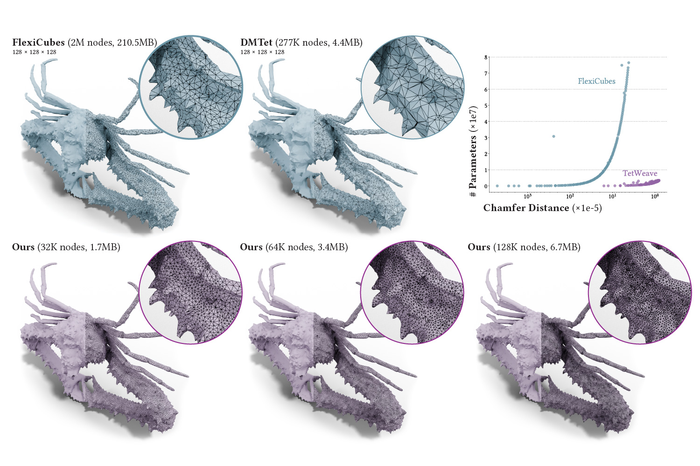
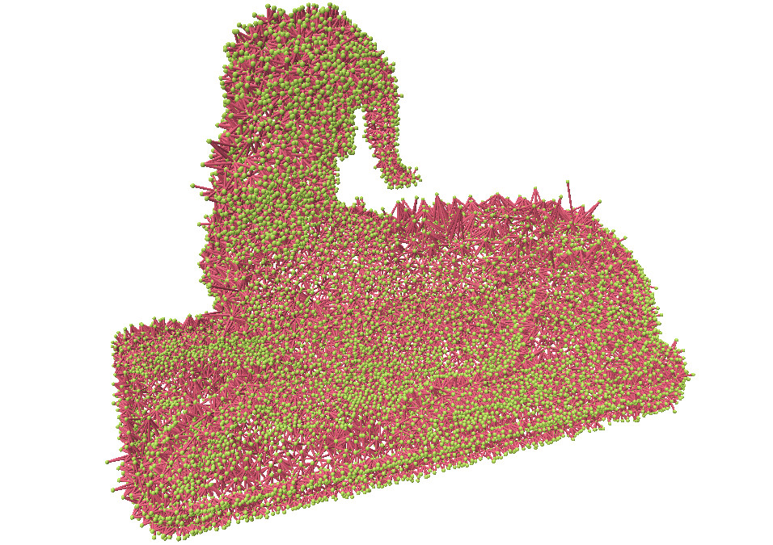
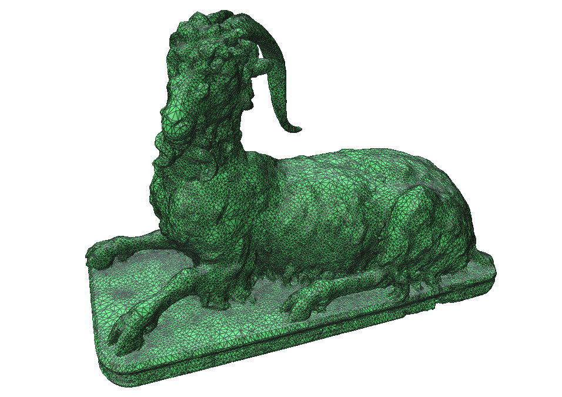
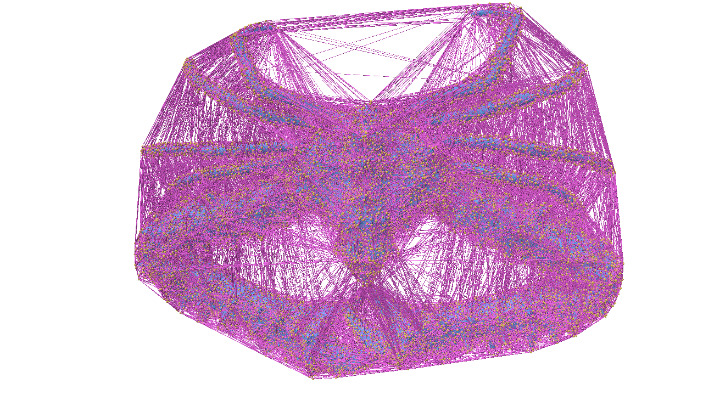
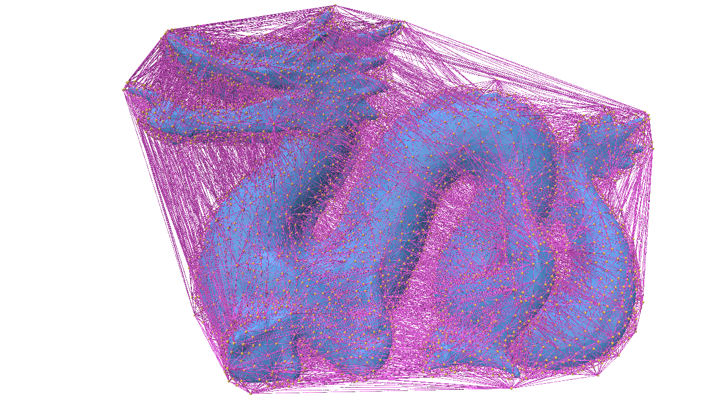
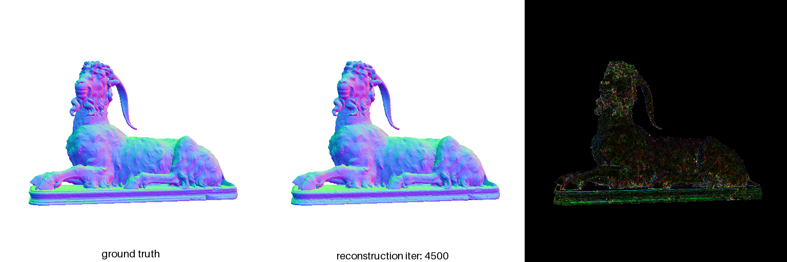

<h1 id="title" align="center">TetWeave: Isosurface Extraction using On-The-Fly Delaunay Tetrahedral Grids for Gradient-Based Mesh Optimization (SIGGRAPH 2025)</h1>
<p align="center">
    <a href="https://www.python.org/"></a>
    <a href="https://opensource.org/license/MIT"></a>
    <a href="https://alexandrebinninger.github.io/TetWeave"></a>
    <a href="https://arxiv.org/abs/TODO" alt ="arXiv"> </a>
    <a href="https://doi.org/10.1145/3730851" alt="doi">
    </a>
</p>



<div align="center">
<p><strong>TetWeave</strong>: Isosurface Extraction using On-The-Fly Delaunay Tetrahedral Grids for Gradient-Based Mesh Optimization</p>
</div>
<p align="center">
    <a href="#introduction">Introduction</a> •
    <a href="#installation">Installation</a> •
    <a href="#quickstart">Quickstart</a> •
    <a href="#instructions">Instructions</a> •
    <a href="#citation">Citation</a> •
    <a href="#acknowledgments">Acknowledgments</a> •
    <a href="#license">License</a>
</p>

<h2 align="center" id="introduction"> Introduction</h2>

This is the codebase for our work **TetWeave: Isosurface Extraction using On-The-Fly Delaunay Tetrahedral Grids for Gradient-Based Mesh Optimization**, accepted as Journal Paper at SIGGRAPH 2025. It implements an adaptive shape representation and optimization pipeline for high-quality mesh reconstruction.


<h2 align="center" id="installation">🔧 Installation</h2>
<p align="right"><a href="#title"><sup>▴ Back to top</sup></a></p>

### Environment

Our code has been tested with CUDA 12.4 on Ubuntu. Create a virtual environment before running the code. Use Conda to set up the environment as follows:

```bash
conda create --name TetWeave python=3.10
conda activate TetWeave
pip install torch==2.5.1 torchvision==0.20.1 torchaudio==2.5.1 --index-url https://download.pytorch.org/whl/cu124
pip install torch_scatter imageio tetgen trimesh tqdm scikit-learn omegaconf transformers gdown polyscope ninja pymeshlab numpy==1.26.4
pip install "git+https://github.com/NVlabs/nvdiffrast/" "git+https://github.com/facebookresearch/pytorch3d.git" kaolin==0.17.0 -f https://nvidia-kaolin.s3.us-east-2.amazonaws.com/torch-2.5.1_cu124.html
```

If you encounter numpy version conflicts, likely due to Tetgen, resolve them with:

```bash
pip install numpy==1.26.4 --force-reinstall
```

### Evaluation dataset (~5.5GB)

After creating the environment, you can download our dataset by running

```bash
python download_evaluation_dataset.py
```

Executing this script will download our [preprocessed dataset](https://drive.google.com/file/d/1e_W2qbtrmV3bxohJhJcqYQJzeGngRXG0/view?usp=sharing), unzip it, and place it in [./assets/data/](./assets/data/).


<h2 align="center" id="quickstart">⏱️ Quickstart</h2>
<p align="right"><a href="#title"><sup>▴ Back to top</sup></a></p>

<p align="center">
  <table>
    <tr>
      <td></td>
      <td></td>
    </tr>
    <tr>
      <td align="center">Resulting active points and active edges</td>
      <td align="center">Reconstructed mesh</td>
    </tr>
  </table>
</p>

After installing the environment, verify it works properly by running:

```bash
python main.py
```

This script will launch the optimization procedure with 32K points, using the [default config file](./assets/configs/default.yaml), which should take less than 4 minutes on a RTX 3090 GPU. Intermediate results will be saved in [./out/default/](./out/default/). More details can be found below.

<h2 align="center" id="instructions">📜 Instructions</h2>
<p align="right"><a href="#title"><sup>▴ Back to top</sup></a></p>

This section details the codebase.

### Shape representation

<p align="center">
  <table>
    <tr>
      <td></td>
      <td></td>
    </tr>
    <tr>
      <td align="center" colspan="2">Visualization of TetWeave's internal representation and extracted mesh.</td>
    </tr>
  </table>
</p>

Our shape representation is particularly simple: a point cloud with SDF values and optional spherical harmonics coefficients. Examples of our representation can be found in the [examples](./assets/examples/) folder. Mesh can be reconstructed and visualized by launching the corresponding script:

```bash
python visualize.py --model_path <MODEL_PATH.pt>
```

`--model_path` or `-mp` takes `"./assets/examples/crab_compressed.pt"` as default argument, and will save the reconstructed mesh to `<MODEL_PATH.obj>`.

The shape reconstruction happens in `tetweave.py`, where the main functions are registered in the class `TetWeave`. The reconstruction happens in `__call__`. It takes the point cloud positions, the sdf, and the spherical harmonics coefficients and degree as input. It then builds a Delaunay tetrahedral grid via Tetgen, and uses Marching Tetrahedra to reconstruct a mesh. If spherical harmonics are used, our implementation of Marching Tets incorporates the computation of the directional signed distance.

### Optimization

<p align="center">
  <table>
    <tr>
      <td></td>
    </tr>
    <tr>
      <td align="center">Intermediate results are periodically saved.</td>
    </tr>
  </table>
</p>

This pipeline corresponds to the sections 4 and 5 of our paper, where we assume that we can render a target shape from any angle, and use this to reconstruct it using TetWeave. To launch the optimization, launch:

```bash
python main.py --config <config_file.yaml> --out_dir <OUT_DIR> --ref_mesh <mesh.obj>
```

Executing this script will use <mesh.obj> as a target mesh to reconstruct and save intermediate results and visualizations in <OUT_DIR>. If enabled in the config file, the program ends up by visualizing the reconstruction via polyscope, and finishes by computing metrics evaluation and saves them in `evaluations.json`. It also renders the ground truth and the reconstructed mesh with high resolution in `final_renders` for visual comparison.

#### Config files

Parameters of the optimization can be found the config file. Most importantly, the config file incorporates the following fields:
- `lr_sdf`, `lr_x_nx3`, and `lr_sh`: the learning rates for the SDF values, the point positions, and the spherical harmonics coefficients.
- `accumulation_delaunay`: the number of steps before two updates of the Tetrahedral grid. Setting this value to 1 will update the Delaunay triangulation at every step, which makes the optimization slower. Default value is 5.
- main stage and late stage's `iter`: the number of iterations for each stage.
- main stage and late stage's `loss`: the different loss weights used during optimization. Because during the late stage, the grid is not updated, there is no ODT loss. We also do not use the fairness loss in this stage either.
- `resampling.aggregation`: if set to `interpolation`, the sdf and spherical harmonics coefficients of the newly sampled points will be computed via barycentric interpolation. If set to `zero`, they will be initialize to 0.
- `resampling.sampling_method`: if set to `error_density_gt`, it will use the error between the target's rendering and the current reconstruction's rendering as a guide to compute the density. If set to `functional_density`, it will use an explicit function, defined by default as a constant function.
- `resampling.voxel_resolution`: resampling consists in estimating the density function over a voxel grid. This parameter gives the resolution of the grid.
- `resampling.steps`: describes at which iterations the resampling occurs, and with how many points. Resampling with the same number of points as the previous steps means that only passive points will be resampled. (NB: the number of points cannot be decreased during the course of the optimization.) 
- `spherical_harmonics`: whether to use spherical harmonics, and with which degree. 

Other fields are either explained, or should be self-explanatory. We provide config files for point clouds ranging from 8K to 128K grid points, with the resampling steps that were used for our paper.

### Compression

After optimization, it is possible to further compress the obtained file by discarding inactive points and converting values to `float16`. This is what the following script does:

```bash
python compress.py --model_path <MODEL.pt> --output_path <MODEL_compressed.pt>
```

A sample model, [GOAT.pt](./assets/examples/GOAT.pt), is provided. Executing `compress.py` with default arguments compresses it **from 1.0MB to 345.5kB**.

<h2 align="center" id="citation">🪪 Citation</h2>
<p align="right"><a href="#title"><sup>▴ Back to top</sup></a></p>

If this work or this codebase are useful to you, please cite them using the bibtex entry below:

```
@article{Binninger:TetWeave:2025,
title={TetWeave: Isosurface Extraction using On-The-Fly Delaunay Tetrahedral Grids for Gradient-Based Mesh Optimization},
author={Binninger, Alexandre and Wiersma, Ruben and Herholz, Philipp and Sorkine-Hornung, Olga},
note={SIGGRAPH 2025 issue},
year={2025},
issue_date = {July 2025},
publisher = {Association for Computing Machinery},
address = {New York, NY, USA},
doi={10.1145/3730851},
journal = {ACM Trans. Graph.},
month = {7}
}
```


<h2 align="center" id="acknowledgments">📢 Acknowledgments</h2>
<p align="right"><a href="#title"><sup>▴ Back to top</sup></a></p>

We thank the anonymous reviewers for their constructive feedback. This work was supported in part by the European Research Council (ERC) under the European Union’s Horizon 2020 research and innovation program (grant agreement No. 101003104, ERC CoG MYCLOTH).

<h2 align="center" id="license">📃 License</h2>
<p align="right"><a href="#title"><sup>▴ Back to top</sup></a></p>

This repository is licensed under the MIT License.